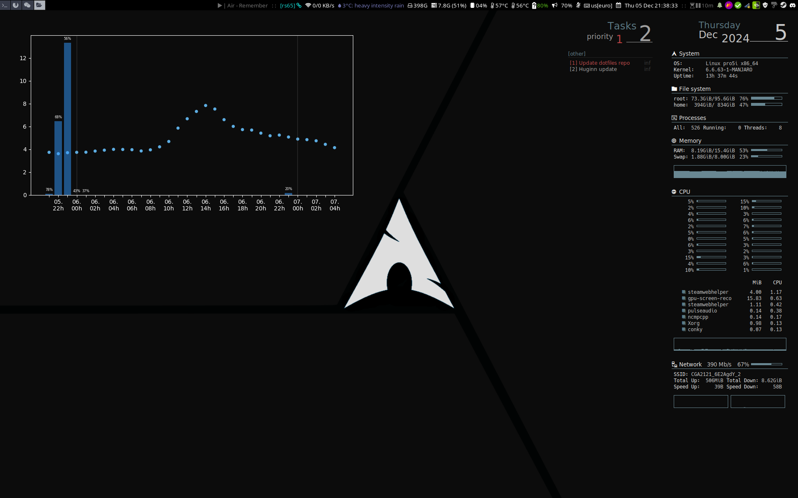
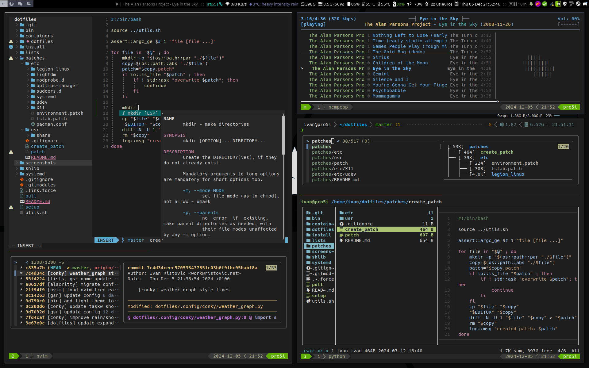
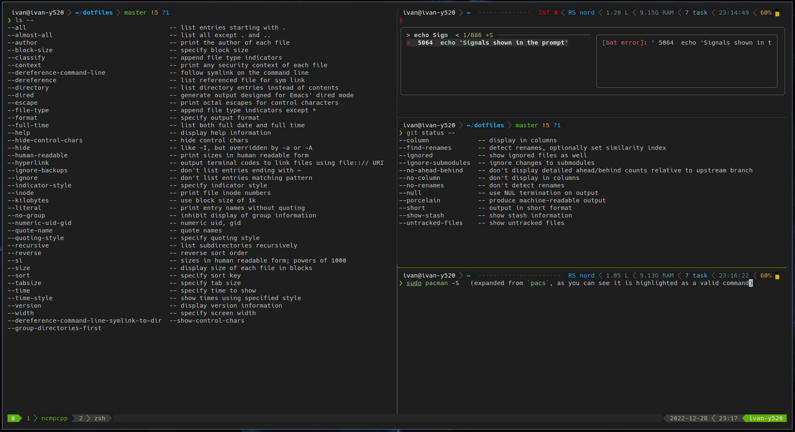

# dotfiles

- **OS**: [Arch Linux](https://archlinux.org/) - [Manjaro](https://manjaro.org/)
- **WM**: [i3](https://i3wm.org/)
- **Shell**: [zsh](https://www.zsh.org/) with [Oh My Zsh](https://ohmyz.sh/) and [powerlevel10k](https://github.com/romkatv/powerlevel10k) theme
- **Terminal**: [alacritty](https://github.com/alacritty/alacritty)
- **Editor**: [neovim](https://neovim.io/) (with Lua config)
- **Session manager**: [tmux](https://github.com/tmux/tmux/wiki)
- **File manager**: [ranger](https://github.com/ranger/ranger)
- **Music player**: [mpd](https://www.musicpd.org/) + [ncmpcpp](https://github.com/ncmpcpp/ncmpcpp)
- **Dotfile manager**: Custom scripts via [GNU Stow](https://www.gnu.org/software/stow/)

This repository contains my personal dotfiles, QOL scripts and binaries, as well as installation scripts for quick setup of Linux systems (primarily for Arch and Ubuntu, since I use them at the moment for my local/cloud machines). Setup can be done by invoking [`setup`](setup), a powerful all-in-one setup and maintenance script. 

## Showcase

### Shell (zsh with oh-my-zsh, p10k prompt)

My custom (additional) features:
- Integration with tmux, nvim, fzf...
- Automatic [alias expansion](dotfiles/.zshrc)
- QOL [aliases](dotfiles/aliases) and [functions](bin)
- Custom [shell library](shlib)
- [Theming](dotfiles/themes)

### Session Manager (tmux)

My custom (additional features):
- Custom [tmux layouting scripts](bin/tx)

### Editor (plugin-enriched Neovim with zsh, git and fzf integration)

### Music Player (mpd + ncmpcpp)

### Search (fzf fuzz search integrated with zsh, nvim and forgit; fd and rg)

### File Manager (ranger)

### Alternative theming
See the [themes](dotfiles/themes) directory for more information

#### Presentation theme

## Repository overview

This repository contains:
- my personal dotfiles symlinked to the home directory ([`dotfiles/`](dotfiles) directory)
- binaries and scripts added to the `PATH` for quick invocation ([`bin/`](bin) directory)
- package install lists ([`lists/`](lists) directory)
- custom package install scripts ([`install/`](install) directory)
- patches for global configuration files ([`patches/`](patches) directory)
- a small shell scripting library ([`shlib/`](shlib) directory)
- containers for sandboxing and testing ([`containers/`](containers) directory)
- custom `systemd` services ([`systemd/`](systemd) directory)

Each directory has a README with more details.

Notable scripts:
- [`setup`](setup) - front-end setup script, can be used for package installations, dotfiles management, etc.
    - `.link.force` - set of paths to be forcefully overwritten when symlinking
- [`pull`](pull) - pulls latest changes from the remote, stashing and re-applying custom changes if they exist

`bin/` directory is placed on the `PATH` automatically if this dotfiles directory is found in user's home directory.

## Invoking the setup

`setup` script can (see `setup --help`):
- install packages from the provided list or command line
- link dotfiles to provided user's home directory
- perform patches to global configuration files
- install custom systemd services

Also check out:
- `lists/` directory for more information on the mass package installation lists
- `install/` directory for more information on how to use the scripts for custom package installations
- `patches/` directory for more information on how to use the automatic config patching system
- `systemd/` directory for more information on how to create custom `systemd` services

