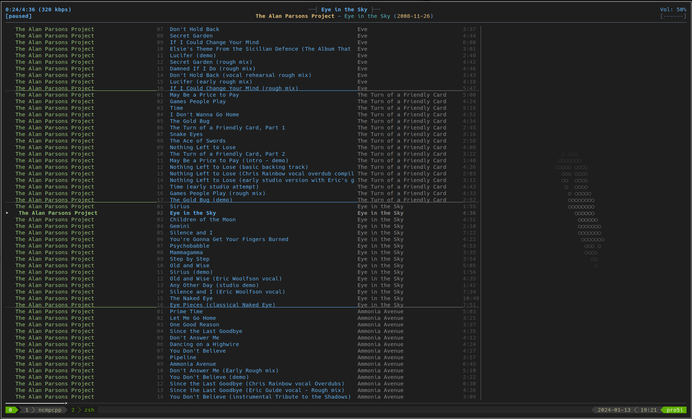

# dotfiles

- **OS**: [Arch Linux](https://archlinux.org/) - [Manjaro](https://manjaro.org/)
- **WM**: [i3](https://i3wm.org/)
- **Shell**: [Zsh](https://www.zsh.org/) with [Oh My Zsh](https://ohmyz.sh/) and [powerlevel10k](https://github.com/romkatv/powerlevel10k) theme
- **Terminal**: [Alacritty](https://github.com/alacritty/alacritty)
- **Editor**: [neovim](https://neovim.io/) (with Lua config)
- **Session manager**: [tmux](https://github.com/tmux/tmux/wiki)
- **File manager**: [ranger](https://github.com/ranger/ranger)
- **Music player**: [mpd](https://www.musicpd.org/) + [ncmpcpp](https://github.com/ncmpcpp/ncmpcpp)
- **Dotfile manager**: Custom scripts via [GNU Stow](https://www.gnu.org/software/stow/)

This repository contains my personal dotfiles, QOL scripts and binaries, as well as installation scripts for quick setup of Linux systems (primarily for Arch and Ubuntu, since I use them at the moment for my local/cloud machines). Setup can be done by invoking [`setup.sh`](setup.sh), a powerful all-in-one setup script. 

## Showcase

### Shell (zsh with oh-my-zsh, p10k prompt)

My custom (additional) features:
- Integration with tmux, nvim, fzf...
- Automatic [alias expansion](dotfiles/.zshrc)
- QOL [aliases](dotfiles/.aliases.zsh) and [functions](bin)
- [Theming](dotfiles/themes)

### Session Manager (tmux)

### Editor (plugin-enriched Neovim with zsh, git and fzf integration)

### Music Player (mpd + ncmpcpp)

### Search (fzf fuzz search integrated with zsh, nvim and forgit; fd and ag)

### File Manager (ranger)

## Repository overview

This repository contains:
- my personal dotfiles symlinked to the home directory ([`dotfiles/`](dotfiles) directory)
- binaries and scripts added to the `PATH` for quick setup ([`bin/`](bin) directory)
- package install lists (`lst_*`) along with custom install scripts ([`install/`](install) directory)
- patches for global configuration files ([`patches`](patches) directory)
- containers for sandboxing and testing ([`containers`](containers) directory)

Each directory has a README with more details.

Notable scripts:
- [`link.sh`](link.sh) - updates dotfile symlinks
- [`setup.sh`](setup.sh) - front-end setup script, can be used for package installations, dotfile management, etc.
- [`pull.sh`](pull.sh) - pulls latest changes from the remote, stashing and re-applying custom changes if they exist

## How does it work?

Invoking `setup.sh` with username and package list will start the setup process that performs the following steps:
- Environment identification (e.g., the package manager)
- Installation list processing
- Dotfiles and `.config` files (from the `dotfiles/` directory) linking to user's home directory using [GNU Stow](https://www.gnu.org/software/stow/) (can be done manually by invoking `link.sh`)

It is possible to perform only some of the above steps by passing options (such as `--dotfiles` or `--packages`). Run `setup.sh --help` for more information.

Additional scripts are available for maintenance:
- `pull.sh` - stashes local changes, pulls the remote and re-stows dotfiles
- `link.sh` - re-stows dotfiles
    - `.link.force` - list of paths to be forcefully overwritten when stowing

Entries from the installation lists are processed in the following manner:
- lines beginning with a `#` sign are treated as comments
- lines beginning with a `+` sign are treated as an "include" command (useful if same entries are present over multiple installation lists)
- if a line does not match any of the above cases, it represents a package/script name
    - if there exists a special setup script matching that name in the `install/` directory, it is invoked
        - if name is prefixed with a `!` sign, then the installation will be performed after stowing (linking) dotfiles
    - otherwise, it is assumed that there exists a package with such name and installation is attempted using the default package manager
        - specially, for Arch Linux, lines prefixed with `aur:` will use `yay` instead of `pacman` for that entry

Check out `install/` directory for more information on how to use the scripts for automatic mass package installations.

Check out `patches/` directory for more information on how to use the automatic file content patching system.

`bin/` directory is placed on the `PATH` automatically if this dotfiles directory is found in user's home directory.

